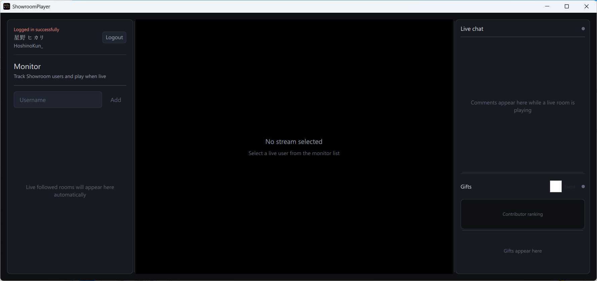

# ShowroomPlayer

****

| Author | HoshinoKun |
| ------ | ----------- |
| E-mail | hoshinokun@346pro.club |

****

[中文简介](/readme_cn.md)



## What's this?
A desktop Showroom live viewer based on Qt 6 and libmpv  
Monitor multiple rooms, play HLS streams, and follow live chat and gifts in real time

## Features
- **Monitor list** — Add Showroom usernames manually; live/offline status updates automatically (default poll interval: 10 seconds)
- **Follow sync** — After login, live rooms from your follow list are added to the monitor automatically
- **Video playback** — HLS playback via libmpv, with pause/resume, stop, and catch-up to live edge
- **Live chat** — Comments, telops, and system messages over the room WebSocket
- **Gifts** — Gift feed, contributor ranking, and optional event mode (×2.5 pt)
- **Session restore** — Login state is saved locally and restored on next launch

## How to use
1. Launch `ShowroomPlayer`.
2. *(Optional)* Click **Login** in the sidebar and sign in with your Showroom account ID and password.  
   Logged-in users get followed live rooms imported into the monitor list automatically.
3. Enter a Showroom **username** in the sidebar and click **Add**.
4. When a user shows **LIVE**, click their row to start playback in the center panel.
5. While a stream is playing, **Live chat** and **Gifts** appear in the right panel.

Playback controls (pause, catch up to live, stop) appear when you move the mouse over the video area.

### Session file
After a successful login, the app saves your session cookie (`sr_id`) to:

```
%APPDATA%/ShowroomPlayer/session.json        (Windows)
~/Library/Application Support/ShowroomPlayer/  (macOS)
~/.config/ShowroomPlayer/                    (Linux)
```

Use **Logout** in the sidebar to clear the saved session.
